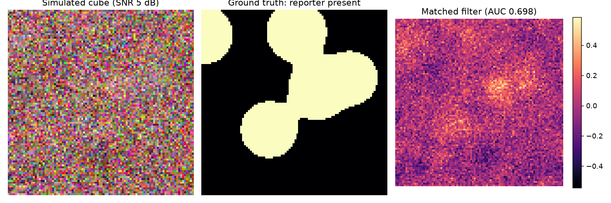
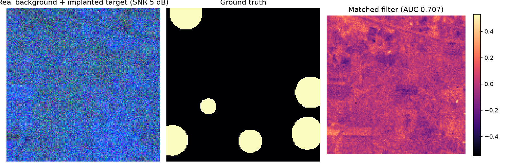

# HyperMix

**Open detection of engineered biosignatures in remote hyperspectral imagery.**

We can now read living, engineered cells from a drone, ninety meters up
(Chemla et al., *Nature Biotechnology*, 2026). But out in the real world that
signal is faint: it hides inside the spectrum of soil, leaves, and water,
the atmosphere distorts it, and cheap sensors bury it in noise. A hyperspectral
camera hands you a mountain of data, not an answer. Pulling the answer out is an
**algorithm** problem, and that is what HyperMix is for.

HyperMix treats detection and spectral unmixing as one regularized inverse
problem, designed from the start for **unknown natural backgrounds, sparse
reference libraries, and low SNR**. It is developed by a physician working in
medical imaging, porting the low-SNR, cross-device reconstruction toolkit from
retinal OCT to biology at a distance.

Funded by the [Hyperspectral Biology grant](https://experiment.com/projects/cldzyecslnphmynjenmv)
(Experiment Foundation). Everything here is MIT licensed.

---

## Status: Phase 0 (foundation)

This first release ships the **ground floor** everything else is measured on:

- **Physics-based scene simulator** with full ground truth. The forward model is
  `illumination · blur( (1 − r)·Σ bₖEₖ + r·R ) + noise`, i.e. an engineered
  reporter `R` at fractional abundance `r` composited over natural background
  endmembers `Eₖ`, then blurred by the instrument PSF and hit with sensor noise
  at a target SNR. Deterministic, NumPy-only, no external data required.
- **Classical baselines**: spectral matched filter and the adaptive cosine
  estimator. This is the floor the learned detector must beat.
- **Detection metrics**: ROC AUC.

### The gap HyperMix exists to close

Matched filter, our strongest classical baseline, on the simulator (seed 0):

| SNR (dB) | Detection AUC |
|---------:|:-------------:|
| 30 | 0.947 |
| 20 | 0.899 |
| 10 | 0.779 |
| 5  | 0.698 |
| 0  | 0.626 |

Detection collapses exactly where it matters most, at low SNR. Closing that gap
is the goal of the physics-informed, self-supervised detector in Milestone 2.



---

## Install

```bash
pip install -e ".[viz]"     # numpy + matplotlib
```

## Quickstart

```python
from hypermix import simulate_scene, spectral_matched_filter, roc_auc

scene = simulate_scene(snr_db=10.0, seed=0)          # cube + full ground truth
score = spectral_matched_filter(scene.cube, scene.reporter)
print("AUC:", roc_auc(score, scene.detection_gt))
```

Reproduce the table and figure:

```bash
python examples/run_demo.py
```

Run the tests:

```bash
pip install -e ".[dev]" && pytest -q
```

---

## Milestone 1: real backgrounds + literature-grounded targets

Two upgrades toward realism:

- **Real background clutter.** `hypermix.datasets` loads a real hyperspectral
  cube (Indian Pines, an AVIRIS scene) and *implants* a known target at
  controlled, sub-pixel abundance, the standard target-detection methodology.
  `python -m hypermix.benchmark` runs all baselines over an SNR sweep on both
  synthetic and real-background scenes and logs `results/benchmark.json`.
- **Targets grounded on the paper.** `reporter_library()` models the two
  reporters Chemla et al. (2026) actually selected, **biliverdin IXα** and
  **bacteriochlorophyll a**, from their reported absorption maxima (approximate
  until the measured spectra are wired in), instead of an arbitrary feature.

Matched filter on **real** Indian Pines background (implanted target, 3 seeds):
AUC 0.920 @ 30 dB → 0.630 @ 0 dB. The low-SNR collapse holds on real clutter too.



## Roadmap

- [x] **Milestone 0** — scene simulator, classical baselines, metrics
- [x] **Milestone 1** — real-background benchmark (AVIRIS), implanted-target harness, paper-grounded reporters
- [ ] **Milestone 2** — physics-informed, self-supervised joint detector + unmixing, with calibrated uncertainty (PyTorch)
- [ ] **Milestone 3** — public release: pip package, Colab notebooks, open spectral dataset + leaderboard, DOI

## Data

Datasets are downloaded, not committed. Fetch the real cube with:

```bash
python scripts/fetch_data.py
```

Indian Pines is a public AVIRIS scene (Purdue University).

## License

MIT. See [LICENSE](LICENSE).
