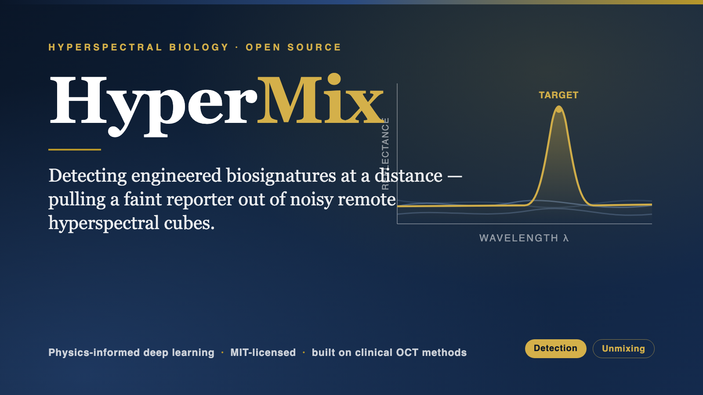
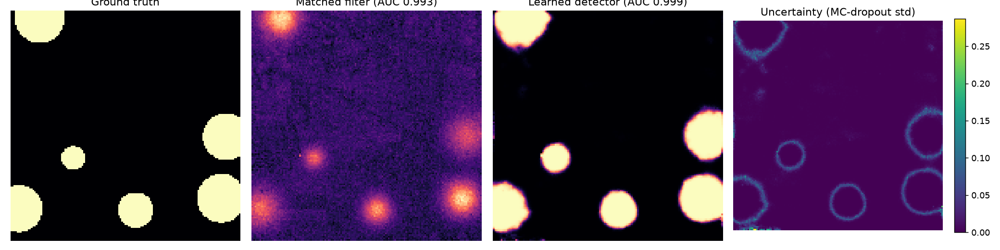

<div align="center">



# 🔬 HyperMix

### Open detection of engineered biosignatures in remote hyperspectral imagery

[](LICENSE)
[](pyproject.toml)
[](hypermix/detector.py)
[](tests/)
[](STATUS.md)
[](https://experiment.com/projects/cldzyecslnphmynjenmv)

*Pulling a faint engineered reporter out of noisy remote hyperspectral cubes, with calibrated uncertainty.*

</div>

---

We can now read living, engineered cells from a drone, ninety meters up
([Chemla et al., *Nature Biotechnology*, 2026](https://www.nature.com/articles/s41587-025-02622-y)).
But out in the real world that signal is faint: it hides inside the spectrum of
soil, leaves, and water, the atmosphere distorts it, and cheap sensors bury it in
noise. A hyperspectral camera hands you a mountain of data, not an answer. Pulling
the answer out is an **algorithm** problem, and that is what HyperMix is for.

HyperMix treats detection and spectral unmixing as one regularized inverse
problem, designed from the start for **unknown natural backgrounds, sparse
reference libraries, and low SNR**. It is developed by a statistician working in
medical imaging, porting the low-SNR, cross-device reconstruction toolkit from
retinal OCT to biology at a distance. Everything here is MIT licensed.

## 📚 Contents

- [✨ Highlights](#-highlights)
- [🚀 Quickstart](#-quickstart)
- [🧪 The learned detector](#-milestone-2-a-learned-detector-that-beats-the-baselines)
- [📊 Benchmarks](#-benchmarks)
- [🗺️ Roadmap](#️-roadmap)
- [💾 Data](#-data)
- [⚠️ Honest limitations](#️-honest-limitations)

## ✨ Highlights

- 🌍 **Physics-based scene simulator** with exact ground truth (NumPy only, deterministic).
- 🛰️ **Real-data benchmark** on a real AVIRIS cube (Indian Pines) via implanted targets.
- 🧬 **Targets grounded on the paper**: biliverdin IXα and bacteriochlorophyll a.
- 🧠 **Detector aprendido**, avaliado contra baselines por pixel e com suavização espacial em 3 fundos reais.
- 🧪 **Unmixing head** that estimates fractional abundance (how much, not just whether).
- 🎯 **Calibrated uncertainty** via MC-dropout (know where to trust the map).
- 🔓 **100% open**, MIT licensed, reproducible from a clean clone.

## 🚀 Quickstart

Run it in your browser, no setup:
[](https://colab.research.google.com/github/JVLegend/HyperMix/blob/main/notebooks/quickstart.ipynb)

Or locally:

```bash
pip install -e ".[viz]"        # numpy + scipy + matplotlib
```

```python
from hypermix import simulate_scene, spectral_matched_filter, roc_auc

scene = simulate_scene(snr_db=10.0, seed=0)          # cube + full ground truth
score = spectral_matched_filter(scene.cube, scene.reporter)
print("AUC:", roc_auc(score, scene.detection_gt))
```

Reproduce everything:

```bash
python examples/run_demo.py         # simulator + baseline, AUC vs SNR
python scripts/fetch_data.py        # download the real AVIRIS cube
python -m hypermix.benchmark        # full benchmark (synthetic + real)
python scripts/train_detector.py    # train the learned detector (needs ".[train]")
python scripts/run_mismatch_experiment.py  # spectral mismatch robustness
pytest -q                           # 15 tests
```

## 🧠 Milestone 2: detector aprendido com contexto espacial

`hypermix.detector` feeds each pixel the scene's **own** adaptive detector
outputs (matched filter, ACE) plus spatial context, z-scored per scene, and a
small PyTorch network learns a nonlinear combination. O treinamento usa apenas
fundos simulados; os testes usam fundos reais com o mesmo alvo sintético, modelo
de mistura linear e gerador de blobs do treino. Portanto, este experimento mede
robustez à troca de fundo, não generalização completa para alvos reais. It ships
**MC-dropout uncertainty**.

<div align="center">

<br><em>Fundo real Indian Pines com alvo implantado a target SNR de 5 dB. O painel compara o matched filter por pixel, o detector aprendido e a incerteza estimada.</em>
</div>

## 📊 Benchmarks

Detection AUC on the **real** Indian Pines background (implanted target, 3 seeds):

| Target SNR (dB) | Matched filter | Matched filter (spatial) | ACE | 🧠 **Learned** |
|----------------:|:--------------:|:------------------------:|:---:|:--------------:|
| 20 | 0.991 | 0.998 | 0.878 | **0.999** |
| 10 | 0.990 | 0.999 | 0.878 | **0.999** |
| 5  | 0.985 | 0.998 | 0.870 | **0.999** |
| 0  | 0.970 | 0.998 | 0.849 | **0.998** |

Target SNR é definido como a razão entre o RMS da contribuição espectral do
alvo, medido nos pixels positivos, e o RMS do ruído aditivo. O baseline espacial
aplica ao matched filter um blur gaussiano fixo com `sigma=1,5` pixel. Na média
das três cenas e quatro níveis de target SNR, o matched filter espacial alcança
0,990 AUC e o detector aprendido 0,987. Portanto, o detector não supera o
comparador espacial neste protocolo. A vantagem sobre o MF por pixel, 0,943
AUC, não isola uma vantagem espectral.

## 🏆 Leaderboard

Detection AUC across **3 real hyperspectral scenes of different sensors and band
counts** (Indian Pines & Salinas: AVIRIS; Pavia University: ROSIS), 3 seeds.
`Mean AUC` averages over all scenes and target SNR = 20, 10, 5, 0 dB. O detector
é treinado apenas em simulação, mas treino e teste compartilham o espectro do
repórter, a mistura linear e o prior de blobs. Reproduce:
`python scripts/make_leaderboard.py`.

| Rank | Method | Mean AUC | AUC @ 0 dB |
|-----:|--------|:--------:|:----------:|
| 1 | Matched filter (spatial) | **0.990** | **0.982** |
| 2 | 🧠 Learned detector (HyperMix) | 0.987 | 0.972 |
| 3 | Matched filter | 0.943 | 0.908 |
| 4 | ACE | 0.860 | 0.811 |
| 5 | Spectral Angle Mapper | 0.656 | 0.655 |

Per-scene AUC @ target SNR de 0 dB. Pavia usa ROSIS; Indian Pines e Salinas usam
AVIRIS. A troca de sensor também altera o número de bandas, mas não torna real o
alvo implantado:

| Method | Indian Pines | Salinas | Pavia U. |
|--------|:---:|:---:|:---:|
| Matched filter (spatial) | **0.998** | **0.998** | **0.951** |
| 🧠 Learned detector | **0.998** | **0.998** | 0.919 |
| Matched filter | 0.970 | 0.969 | 0.786 |

### Robustez a mismatch espectral

O alvo implantado permanece fixo, mas a assinatura entregue aos detectores é
deslocada no eixo normalizado de índices de bandas. AUC média em três cenas,
três seeds e target SNR de 5 dB:

| Deslocamento | MF AUC (queda) | MF espacial AUC (queda) | Detector AUC (queda) |
|-------------:|:--------------:|:-----------------------:|:--------------------:|
| 0% | 0.940 (0.000) | **0.990 (0.000)** | 0.987 (0.000) |
| 1% | 0.899 (0.041) | **0.983 (0.007)** | 0.973 (0.014) |
| 2,5% | 0.781 (0.159) | **0.920 (0.070)** | 0.907 (0.080) |
| 5% | 0.647 (0.293) | **0.730 (0.260)** | 0.710 (0.277) |

O deslocamento é uma fração da faixa de índices, não uma distância em
nanômetros, pois as grades espectrais dos sensores diferem. O experimento mede
sensibilidade a mismatch controlado, não substitui validação com espectros
medidos. Resultados completos em [results/mismatch.md](results/mismatch.md).

## 🧪 Unmixing: how much, not just whether

Detection asks *is the reporter here?* Unmixing asks *how much?* `AbundanceUnmixer`
adds a regression head (same scene-adaptive features) that estimates the target's
fractional abundance. A avaliação usa apenas pixels com abundância maior que
`0,02` para Pearson r e target MAE, evitando que os zeros do fundo dominem o
resultado. Target SNR de 10 dB, média de 3 seeds:

| Cena | MF target r | Unmixer target r | MF target MAE | Unmixer target MAE |
|---|:---:|:---:|:---:|:---:|
| Indian Pines | 0.966 | **0.982** | 0.0142 | **0.0081** |
| Salinas | 0.979 | **0.988** | **0.0073** | 0.0237 |
| Pavia University | 0.796 | **0.938** | 0.0177 | **0.0093** |

O unmixer tem maior correlação nas três cenas e menor target MAE em duas. Em
Salinas, porém, sua target MAE é mais de três vezes a do MF, evidenciando viés
de escala que a correlação isolada esconderia. A MAE em todos os pixels também
é preservada em [results/unmix_eval.md](results/unmix_eval.md) como diagnóstico
secundário.

Reproduce: `python scripts/train_unmixer.py`.

## 📦 Open spectral dataset

`dataset/` ships an open spectral library (CSV + NPZ): the background endmembers
and the two paper-grounded reporters (biliverdin IXα, bacteriochlorophyll a) on a
400-1000 nm grid, with a [data card](dataset/DATA_CARD.md). Regenerate with
`python scripts/export_dataset.py`.

## 🗺️ Roadmap

- [x] **Milestone 0** — scene simulator, classical baselines, metrics
- [x] **Milestone 1** — real-background benchmark (AVIRIS), implanted-target harness, paper-grounded reporters
- [x] **Milestone 2** — physics-informed learned detector with MC-dropout uncertainty, avaliado em troca de fundo simulado para real
- [ ] **Milestone 3** — public release (in progress): ✅ Colab notebook · ✅ open spectral dataset + leaderboard · ✅ 3-scene cross-sensor benchmark · ✅ build + CITATION/Zenodo metadata · ⏳ PyPI publish · ⏳ DOI

## 💾 Data

Datasets are downloaded, not committed:

```bash
python scripts/fetch_data.py
```

Indian Pines is a public AVIRIS scene (Purdue University).

## ⚠️ Honest limitations

- Reporter spectra are modeled from published absorption maxima, not yet the
  measured spectra. They drop in without any API change once available.
- O matched filter espacial supera o detector aprendido no leaderboard atual;
  a vantagem sobre baselines por pixel é explicada em grande parte pelo prior
  espacial de alvos em blob.
- Treino e teste compartilham repórter aproximado, gerador de blobs e mistura
  linear. Os fundos são reais a jusante, mas os alvos implantados não são.
- Um deslocamento espectral de 5% reduz a AUC do detector aprendido em 0,277;
  ainda não há teste com variabilidade biológica ou espectro medido.
- No unmixing de Salinas, maior correlação não implica menor erro: target MAE
  de 0,0237 no unmixer contra 0,0073 no MF.
- The first learned model is a small MLP; richer models and a true unmixing head
  are future work. All numbers, including failures, are tracked in [STATUS.md](STATUS.md).

## 📚 Cite

If you use HyperMix, please cite it (see [CITATION.cff](CITATION.cff)). A Zenodo
DOI is planned for the next release.

## 📄 License

MIT. See [LICENSE](LICENSE). Built with support from the
[Experiment Foundation](https://experiment.com/projects/cldzyecslnphmynjenmv)
Hyperspectral Biology grant.
