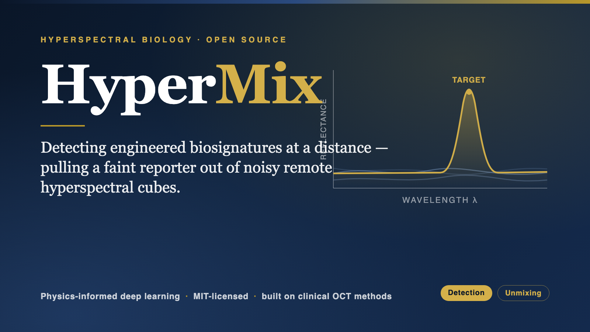
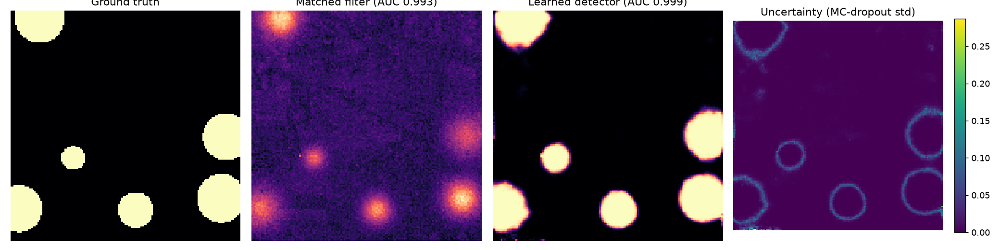

<div align="center">



# 🔬 HyperMix

### Open detection of engineered biosignatures in remote hyperspectral imagery

[](LICENSE)
[](https://pypi.org/project/hypermix/)
[](https://doi.org/10.5281/zenodo.21799950)
[](pyproject.toml)
[](hypermix/detector.py)
[](tests/)
[](https://github.com/JVLegend/HyperMix/actions/workflows/ci.yml)
[](STATUS.md)
[](https://hypermix-observatory.vercel.app)
[](https://experiment.com/projects/cldzyecslnphmynjenmv)

*Benchmarking faint engineered reporters in noisy remote hyperspectral cubes, with calibrated uncertainty and explicit baselines.*

</div>

---

We can now read living, engineered cells from a drone, ninety meters up
([Chemla et al., *Nature Biotechnology*, 2026](https://www.nature.com/articles/s41587-025-02622-y)).
But out in the real world that signal is faint: it hides inside the spectrum of
soil, leaves, and water, the atmosphere distorts it, and cheap sensors bury it in
noise. A hyperspectral camera hands you a mountain of data, not an answer. Pulling
the answer out is an **algorithm** problem, and that is what HyperMix is for.

HyperMix tests detection and spectral unmixing as regularized inverse problems
under **unknown natural backgrounds, sparse reference libraries, and low SNR**.
It is developed by a statistician working in medical imaging, porting the
low-SNR, cross-device reconstruction toolkit from retinal OCT to biology at a
distance. Everything here is MIT licensed. So far, the learned methods have not
robustly surpassed a well-calibrated spatial matched filter; the open benchmark
and its negative results are the contribution.

## 📚 Contents

- [✨ Highlights](#-highlights)
- [🚀 Quickstart](#-quickstart)
- [🌐 Web Observatory](#-web-observatory)
- [🧪 The learned detector](#-milestone-2-detector-aprendido-com-contexto-espacial)
- [📊 Benchmarks](#-benchmarks)
- [🔎 Evidence bundle](#-evidence-bundle)
- [🗺️ Roadmap](#️-roadmap)
- [💾 Data](#-data)
- [⚠️ Honest limitations](#️-honest-limitations)
- [🤝 Contributing](CONTRIBUTING.md)

## ✨ Highlights

- 🌍 **Physics-based scene simulator** with exact ground truth (NumPy only, deterministic).
- 🛰️ **Real-background benchmark** on an AVIRIS cube (Indian Pines) via implanted synthetic targets.
- 🧬 **Espectros medidos**: endmembers USGS e absorbância de pellets bioHSI para biliverdina/SmURFP e bacterioclorofila a.
- 🧠 **Detector aprendido**, avaliado contra baselines por pixel e com suavização espacial em 3 fundos reais.
- 🧪 **Unmixing head** that estimates fractional abundance (how much, not just whether).
- 🎯 **Calibrated uncertainty benchmark** with Platt scaling, temperature
  scaling, NLL, Brier, ECE and reliability curves.
- 🔭 **Laboratory-to-sensor target transfer** using declared sensor response
  and a leakage-free atmospheric model.
- 🔓 **100% open**, MIT licensed, reproducible from a clean clone.

## 🚀 Quickstart

Run it in your browser, no setup:
[](https://colab.research.google.com/github/JVLegend/HyperMix/blob/main/notebooks/quickstart.ipynb)

Or locally:

```bash
pip install "hypermix[viz]"     # published package
```

```python
from hypermix import simulate_scene, spectral_matched_filter, roc_auc

scene = simulate_scene(snr_db=10.0, seed=0)          # cube + full ground truth
score = spectral_matched_filter(scene.cube, scene.reporter)
print("AUC:", roc_auc(score, scene.detection_gt))
```

Reproduce everything:

```bash
python examples/run_demo.py         # simulator + baseline, AUC vs SNR
python scripts/fetch_data.py        # download the real AVIRIS cube
python -m hypermix.benchmark        # full benchmark (synthetic + real)
python scripts/train_detector.py    # train the learned detector (needs ".[train]")
python scripts/run_mismatch_experiment.py  # spectral mismatch robustness
python scripts/realism_experiment.py       # measured spectra + SRF + atmosphere
python scripts/target_variability_experiment.py  # measured target variability
python scripts/target_transfer_experiment.py  # laboratory-to-sensor transfer
python scripts/blind_target_experiment.py  # held-out and unknown targets
python scripts/lod_experiment.py    # detection limit by sensor and FAR
python scripts/abundance_uncertainty_experiment.py  # calibrated abundance
python scripts/verify_evidence_manifest.py  # verify publication artifacts
pytest -q                           # 103 tests
```

Para desenvolver a partir do clone, use `pip install -e ".[viz,dev]"`.

## 🌐 Web Observatory

Explore a fotografia auditada dos resultados em
[hypermix-observatory.vercel.app](https://hypermix-observatory.vercel.app).
O painel permite variar target SNR, mismatch espectral e tracks de
variabilidade, além de comparar alvo oráculo e alvo laboratorial sob os
controles físicos da Fase B e inspecionar o resultado T9 de transferência
laboratório-sensor.

A interface abre em inglês e oferece as bandeiras dos Estados Unidos e do
Brasil no topo para alternar todo o conteúdo entre inglês e português sem sair
da página.

O Map Studio permite enviar localmente um PNG, JPEG ou WebP de um mapa de scores
e explorar a máscara em diferentes limiares. O brilho é interpretado como score
apenas para visualização; imagens RGB não executam inferência HyperMix e nunca
são enviadas ao servidor.

O observatório é uma visualização interativa dos artefatos em `results/`. Ele
não treina o modelo nem executa inferência no navegador, e os números não são
sincronizados automaticamente. A conclusão honesta permanece visível no
produto: o detector aprendido não supera de forma robusta um matched filter
espacial bem calibrado neste benchmark.

Para executar ou publicar o app, consulte [webapp/README.md](webapp/README.md).

## 🧠 Milestone 2: detector aprendido com contexto espacial

`hypermix.detector` feeds each pixel the scene's **own** adaptive detector
outputs (matched filter, ACE) plus spatial context, z-scored per scene, and a
small PyTorch network learns a nonlinear combination. O treinamento usa apenas
fundos simulados; os testes usam fundos reais com o mesmo alvo sintético, modelo
de mistura linear e gerador de blobs do treino. Portanto, este experimento mede
robustez à troca de fundo, não generalização completa para alvos reais. It ships
**MC-dropout uncertainty**.

<div align="center">

<br><em>Fundo real Indian Pines com alvo implantado a target SNR de 5 dB. O painel compara o matched filter por pixel, o detector aprendido e a incerteza estimada.</em>
</div>

## 📊 Benchmarks

Detection AUC on the **real** Indian Pines background (implanted target, 3 seeds):

| Target SNR (dB) | Matched filter | Matched filter (spatial) | ACE | 🧠 **Learned** |
|----------------:|:--------------:|:------------------------:|:---:|:--------------:|
| 20 | 0.991 | 0.998 | 0.878 | **0.999** |
| 10 | 0.990 | 0.999 | 0.878 | **0.999** |
| 5  | 0.985 | 0.998 | 0.870 | **0.999** |
| 0  | 0.970 | 0.998 | 0.849 | **0.998** |

Target SNR é definido como a razão entre o RMS da contribuição espectral do
alvo, medido nos pixels positivos, e o RMS do ruído aditivo. O baseline espacial
aplica ao matched filter um blur gaussiano fixo com `sigma=1,5` pixel. Na média
das três cenas e quatro níveis de target SNR, o matched filter espacial alcança
0,990 AUC e o detector aprendido 0,987. Portanto, o detector não supera o
comparador espacial neste protocolo. A vantagem sobre o MF por pixel, 0,943
AUC, não isola uma vantagem espectral.

## 🏆 Leaderboard

Detection AUC across **3 real hyperspectral scenes of different sensors and band
counts** (Indian Pines & Salinas: AVIRIS; Pavia University: ROSIS), 3 seeds.
`Mean AUC` averages over all scenes and target SNR = 20, 10, 5, 0 dB. O detector
é treinado apenas em simulação, mas treino e teste compartilham o espectro do
repórter, a mistura linear e o prior de blobs. Reproduce:
`python scripts/make_leaderboard.py`.

| Rank | Method | Mean AUC | AUC @ 0 dB |
|-----:|--------|:--------:|:----------:|
| 1 | Matched filter (spatial) | **0.990** | **0.982** |
| 2 | 🧠 Learned detector (HyperMix) | 0.987 | 0.972 |
| 3 | Matched filter | 0.943 | 0.908 |
| 4 | ACE | 0.860 | 0.811 |
| 5 | Spectral Angle Mapper | 0.656 | 0.655 |

Per-scene AUC @ target SNR de 0 dB. Pavia usa ROSIS; Indian Pines e Salinas usam
AVIRIS. A troca de sensor também altera o número de bandas, mas não torna real o
alvo implantado:

| Method | Indian Pines | Salinas | Pavia U. |
|--------|:---:|:---:|:---:|
| Matched filter (spatial) | **0.998** | **0.998** | **0.951** |
| 🧠 Learned detector | **0.998** | **0.998** | 0.919 |
| Matched filter | 0.970 | 0.969 | 0.786 |

### Robustez a mismatch espectral

O alvo implantado permanece fixo, mas a assinatura entregue aos detectores é
deslocada no eixo normalizado de índices de bandas. AUC média em três cenas,
três seeds e target SNR de 5 dB:

| Deslocamento | MF AUC (queda) | MF espacial AUC (queda) | Detector AUC (queda) |
|-------------:|:--------------:|:-----------------------:|:--------------------:|
| 0% | 0.940 (0.000) | **0.990 (0.000)** | 0.987 (0.000) |
| 1% | 0.899 (0.041) | **0.983 (0.007)** | 0.973 (0.014) |
| 2,5% | 0.781 (0.159) | **0.920 (0.070)** | 0.907 (0.080) |
| 5% | 0.647 (0.293) | **0.730 (0.260)** | 0.710 (0.277) |

O deslocamento é uma fração da faixa de índices, não uma distância em
nanômetros, pois as grades espectrais dos sensores diferem. O experimento mede
sensibilidade a mismatch controlado, não substitui validação com espectros
medidos. Resultados completos em [results/mismatch.md](results/mismatch.md).

### Realismo físico opt-in

A Fase B adiciona quatro controles sem alterar os defaults usados nos números
da Fase A: espectros medidos, SRF gaussiana parametrizada em nanômetros,
atmosfera simples com absorções estruturadas e mistura bilinear generalizada.
O artefato [results/realism.md](results/realism.md) usa uma grade simulada
calibrada em comprimento de onda, target SNR de 20, 10, 5 e 0 dB e 5 seeds.

| Cenário | MF | MF espacial | ACE | SAM | MF espacial com alvo lab |
|---------|:--:|:-----------:|:---:|:---:|:------------------------:|
| Controle estilizado, linear | 0.952 | 0.983 | 0.715 | 0.907 | 0.983 |
| Espectros medidos, linear | 0.976 | 0.995 | 0.719 | 0.968 | 0.995 |
| Medidos + SRF 10 nm | 0.976 | 0.994 | 0.719 | 0.968 | 0.995 |
| Medidos + SRF + atmosfera | 0.976 | 0.994 | 0.719 | 0.968 | 0.913 |
| Medidos + SRF + atmosfera + bilinear | 0.947 | 0.983 | 0.714 | 0.969 | 0.906 |

O alvo oráculo é a assinatura exata depois do sensor e da atmosfera. O alvo
laboratorial usa a absorbância medida convertida antes dessas transformações.
Por isso, SRF e atmosfera quase não penalizam o MF oráculo, mas o mismatch
atmosférico reduz o MF espacial de 0,994 para 0,913. A mistura bilinear reduz o
MF espacial oráculo de 0,994 para 0,983.

No teste separado com três fundos reais, o detector aprendido também não obtém
vantagem robusta: sob mistura linear, MF espacial 0,986 vs aprendido 0,980;
sob mistura bilinear, 0,989 vs 0,992, empate dentro da margem de 0,005. Esses
MAT não carregam centros de banda, então o teste não linear real usa alvo por
índice espectral e deve ser interpretado apenas como análise de sensibilidade.

### Variabilidade do alvo medido

O último teste da arquitetura atual usa um alvo sorteado de bibliotecas medidas,
enquanto o MF e as cinco features do detector aprendido recebem apenas um alvo
nominal fixo. O baseline de subespaço segue a formulação clássica de
[matched subspace detection](https://doi.org/10.1109/78.301849). AUC média em
target SNR de 20, 10, 5 e 0 dB, com 6 seeds estratificadas por ponto:

| Track | MF espacial nominal | Subespaço espacial | Aprendido | MF espacial oráculo |
|-------|:-------------------:|:------------------:|:---------:|:-------------------:|
| Hospedeiro, SmURFP/biliverdina | 0.996 | 0.967 | 0.997 | 0.997 |
| Hospedeiro + sensor + atmosfera | 0.993 | 0.910 | 0.996 | 0.995 |
| Qualquer repórter, BChl ou biliverdina | 0.907 | **0.948** | 0.928 | 0.996 |

Nos dois tracks intra-SmURFP, o detector aprendido fica em empate com o MF
espacial nominal pela margem de 0,005. No track heterogêneo de qualquer
repórter, o subespaço espacial supera o aprendido por 0,020 AUC. Portanto,
variabilidade do alvo também não fornece uma vitória robusta para o MLP atual.
O track de família não deve ser descrito como variabilidade intra-molécula.

O experimento usa endmembers USGS em cenas implantadas, com grade calibrada de
400-1000 nm. Ele não é validação remota de expressão biológica naturalmente
observada. Resultados completos em
[results/target_variability.md](results/target_variability.md).

### Transferência laboratório-sensor

T9 transforma o espectro laboratorial usando somente o FWHM declarado do
sensor, uma atmosfera fixa ou uma família pré-especificada e nenhum rótulo de
avaliação. O experimento usa 45 casos pareados, com três respostas espectrais,
cinco atmosferas por seed e target SNR de 10, 5 e 0 dB.

| Alvo do detector | AUC [IC 95%] | Pd@FAR 1e-3 [IC 95%] |
|---|:---:|:---:|
| Laboratorial | 0.968 [0.962, 0.974] | 0.626 [0.587, 0.672] |
| Transferência nominal | **0.990 [0.988, 0.992]** | **0.760 [0.727, 0.787]** |
| Família física por subespaço | 0.777 [0.749, 0.799] | 0.369 [0.340, 0.394] |
| Oráculo | 0.992 [0.991, 0.994] | 0.778 [0.744, 0.805] |

O critério primário foi congelado para a família física contra o alvo
laboratorial e falhou nas duas métricas. A transferência nominal, método
declarado mas secundário para significância, melhorou AUC em 0.022
`[0.016, 0.028]` e Pd em 0.134 `[0.097, 0.169]`, quase alcançando o oráculo.
Esse resultado favorece uma correção física estreita, não aprendizado e nem uma
família ampla de assinaturas. Ele ainda usa alvos implantados e precisa de
validação independente. Resultados completos em
[results/target_transfer.md](results/target_transfer.md).

### Alvo retido e detecção cega

T10 separa o teto oracle de dois regimes sem acesso ao alvo exato. No regime
família, E. coli é retido e somente P. putida é permitido, e vice-versa. No
regime cego, nenhum espectro de alvo é fornecido. O teste cobre 48 casos
pareados nas três cenas reais, com alvos implantados, dois SNRs e quatro seeds.

| Regime e método | AUC [IC 95%] | Pd@FAR 1e-3 [IC 95%] |
|---|:---:|:---:|
| Oracle, MF com alvo exato | 0.984 [0.960, 0.998] | 0.562 [0.105, 0.810] |
| Família, MF com centroide | **0.983 [0.956, 0.998]** | **0.556 [0.091, 0.808]** |
| Família, MLP | 0.970 [0.924, 0.998] | 0.514 [0.036, 0.783] |
| Cego, RX | 0.511 [0.399, 0.632] | 0.000 [0.000, 0.002] |
| Cego, MLP | 0.503 [0.405, 0.607] | 0.000 [0.000, 0.001] |

O aprendizado não venceu. O MF construído apenas com o outro host quase
alcançou o oracle, enquanto o MLP familiar ficou abaixo dele nos dois
desfechos. Isso indica robustez estreita entre estes dois espectros biliverdina,
não generalização entre famílias químicas. Resultados completos em
[results/blind.md](results/blind.md).

### Limite operacional de detecção

T11 muda a pergunta de comparação de métodos para planejamento experimental.
Thresholds de FAR são calibrados em cenas sem alvo, avaliados em seeds distintos
e aplicados a curvas com ruído absoluto fixo. O LOD é o primeiro nível testado
que mantém Pd maior ou igual a 0,80 em todos os níveis superiores.

| FWHM | FAR | FAR obtido [IC 95%] | LOD nominal | LOD conservador |
|---:|---:|:---:|:---:|:---:|
| 8 nm | 1e-2 | 0.00680 [0.00485, 0.00873] | 15% | 20% |
| 12 nm | 1e-2 | 0.00637 [0.00444, 0.00870] | 15% | 20% |
| 20 nm | 1e-2 | 0.00285 [0.00124, 0.00484] | 20% | acima de 20% |
| todos | 1e-3 | budget validado | acima de 20% | acima de 20% |

A abundância é o máximo do blob implantado no simulador, não concentração
biológica. O detector é o MF espacial com alvo exato no sensor, então estes
valores são um teto algorítmico e não garantia de campo. Curvas e IC completos
em [results/lod.md](results/lod.md).

## 🧪 Unmixing: how much, not just whether

Detection asks *is the reporter here?* Unmixing asks *how much?* `AbundanceUnmixer`
adds a regression head (same scene-adaptive features) that estimates the target's
fractional abundance. A avaliação usa apenas pixels com abundância maior que
`0,02` para Pearson r e target MAE, evitando que os zeros do fundo dominem o
resultado. Target SNR de 10 dB, média de 3 seeds:

| Cena | MF target r | Unmixer target r | MF target MAE | Unmixer target MAE |
|---|:---:|:---:|:---:|:---:|
| Indian Pines | 0.966 | **0.982** | 0.0142 | **0.0081** |
| Salinas | 0.979 | **0.988** | **0.0073** | 0.0237 |
| Pavia University | 0.796 | **0.938** | 0.0177 | **0.0093** |

O unmixer tem maior correlação nas três cenas e menor target MAE em duas. Em
Salinas, porém, sua target MAE é mais de três vezes a do MF, evidenciando viés
de escala que a correlação isolada esconderia. A MAE em todos os pixels também
é preservada em [results/unmix_eval.md](results/unmix_eval.md) como diagnóstico
secundário.

Reproduce: `python scripts/train_unmixer.py`.

### Abundância calibrada e intervalos

T12 separa treino, calibração de escala, calibração conformal e avaliação. Cada
cena-seed recebe peso igual, e os IC usam casos pareados em vez de pixels como
unidade de bootstrap. Os intervalos de 90% são condicionais aos pixels de alvo.

| Método | MAE [IC 95%] | Cobertura | Largura |
|---|:---:|:---:|:---:|
| MF calibrado | **0.0110 [0.0093, 0.0129]** | 0.971 | **0.0719** |
| Unmixer calibrado | 0.0136 [0.0116, 0.0158] | 0.987 | 0.0815 |

A diferença pareada de MAE cruza zero, mas o unmixer tem viés absoluto maior
por +0.0064 [0.0032, 0.0096] e intervalos mais largos por +0.0096
[0.0090, 0.0102]. Assim, o critério pré-especificado não encontra vantagem
calibrada do aprendizado. Isso não muda o fato de que o unmixer é melhor em
Pavia U.; mostra que a melhora não se sustenta agregada nas três cenas.

Resultado completo em
[results/abundance_uncertainty.md](results/abundance_uncertainty.md).

## 🔎 Evidence bundle

Cada afirmação principal do pacote de publicação está ligada ao comando
gerador, aos artefatos, aos checksums SHA-256 e às limitações correspondentes.
Verifique a cadeia completa sem dependências científicas:

```bash
python scripts/verify_evidence_manifest.py
```

Consulte a [matriz de evidências](publication/EVIDENCE_MATRIX.md), o
[protocolo externo](publication/EXTERNAL_REPRODUCTION.md) e o
[esqueleto do preprint](publication/PREPRINT_OUTLINE.md). O T8 aparece como
bloqueado, não como uma comparação concluída em alvo biológico real.

## 📦 Open spectral dataset

`dataset/` contém uma biblioteca aberta em CSV e NPZ: quatro endmembers medidos
do USGS, absorbâncias de pellets publicadas no bioHSI e os dois alvos semelhantes
a reflectância derivados por Beer-Lambert. A grade de conveniência tem 400-1000
nm em passos de 10 nm; a fonte empacotada preserva 1 nm. Veja o
[data card](dataset/DATA_CARD.md). Reconstrua com
`python scripts/fetch_reference_spectra.py` e `python scripts/export_dataset.py`.

## 🗺️ Roadmap

- [x] **Milestones 0–2**: simulador, baselines, três fundos reais, detector
      aprendido, realismo físico e auditorias T1/T7.
- [ ] **T8**: validar em cubos bioHSI com expressão biológica medida, sem
      implantação digital. Manifesto e downloader rastreável já concluídos.
- [x] **T9a**: transferência laboratório-sensor em simulador calibrado, sem
      rótulos de avaliação. Validação bioHSI continua dependente de T8.
- [x] **T10**: alvo retido e detecção cega com contratos sem vazamento.
- [x] **T11**: limite de detecção por FWHM e FAR com calibração externa.
- [x] **Milestone 3**: CI, PyPI, release `v0.5.0` e DOI do Zenodo.
- [x] **T12**: abundância calibrada e intervalos agrupados, sem vantagem do
      aprendizado no agregado.
- [x] **T13a**: matriz de evidências, hashes, verificador e esqueleto do
      preprint.
- [ ] **T13b**: reprodução externa e validação das coordenadas da Figura 4g.

O plano completo, com dependências, critérios de aceite e limites honestos,
está em [ROADMAP.md](ROADMAP.md).

## 💾 Data

Datasets are downloaded, not committed:

```bash
python scripts/fetch_data.py
python scripts/fetch_biohsi.py --list
```

Indian Pines is a public AVIRIS scene (Purdue University).

Os cubos bioHSI de Chemla et al. são baixados sob demanda para `data/biohsi/`.
O manifesto curado fixa DOI, versão, licença, tamanho e checksum. O download do
primeiro conjunto real de 54 m é explícito porque o arquivo possui cerca de
629 MB:

```bash
python scripts/fetch_biohsi.py --dataset rg_on_sand_induction_54m.zip
python scripts/biohsi_roi_overlay.py
python scripts/reproduce_biohsi_54m.py
```

A reprodução HKM requer `pip install -e ".[reproduce,viz]"`. A auditoria que
executa a tag externa dos autores também requer o extra `hsi`.

O protocolo pré-especificado da análise de 54 m está em
[results/real_target_protocol.md](results/real_target_protocol.md). A primeira
porta de reprodução falhou, inclusive ao executar diretamente a tag oficial nas
caixas candidatas. Por isso elas não são tratadas como coordenadas confirmadas
da Figura 4g e nenhum baseline foi comparado. O diagnóstico está em
[results/real_target_reproduction_diagnosis.md](results/real_target_reproduction_diagnosis.md).

Os espectros compactos de referência são versionados no pacote. As fontes são
USGS Spectral Library Version 7 e o arquivo oficial bioHSI associado a Chemla
et al.; URLs, licença e checksums estão em
[hypermix/data/REFERENCE_SPECTRA.md](hypermix/data/REFERENCE_SPECTRA.md).

## ⚠️ Honest limitations

- Os repórteres medidos são absorbâncias inferidas de pellets, não reflectância
  absoluta de uma superfície observada remotamente. A conversão por Beer-Lambert
  é explícita, mas ainda é uma hipótese do simulador.
- Os endmembers USGS são quatro amostras medidas e não cobrem a variabilidade
  natural de solo, vegetação e água.
- O matched filter espacial supera o detector aprendido no leaderboard atual;
  a vantagem sobre baselines por pixel é explicada em grande parte pelo prior
  espacial de alvos em blob.
- O leaderboard da Fase A ainda compartilha repórter aproximado, gerador de
  blobs e mistura linear entre treino e teste. Os fundos são reais a jusante,
  mas os alvos implantados não são.
- Mesmo treinado sobre variabilidade medida, o MLP atual só recebe MF, ACE e
  versões suavizadas calculadas com o alvo nominal. Ele não acessa informação
  espectral que esses detectores descartam.
- Um deslocamento espectral de 5% reduz a AUC do detector aprendido em 0,277;
  ainda não há validação remota independente com variabilidade biológica.
- Os cubos MAT atuais não incluem os centros de banda. A avaliação física
  calibrada em nanômetros permanece simulada até obter metadados espectrais
  rastreáveis para cada cena real.
- No unmixing de Salinas, maior correlação não implica menor erro: target MAE
  de 0,0237 no unmixer contra 0,0073 no MF.
- The first learned model is a small MLP; richer models and a true unmixing head
  are future work. All numbers, including failures, are tracked in [STATUS.md](STATUS.md).

## 📚 Cite

If you use HyperMix, please cite it using [CITATION.cff](CITATION.cff) and the
version DOI [`10.5281/zenodo.21799951`](https://doi.org/10.5281/zenodo.21799951).
For a citation that should always resolve to the latest archived version, use
the concept DOI [`10.5281/zenodo.21799950`](https://doi.org/10.5281/zenodo.21799950).

## 📄 License

MIT. See [LICENSE](LICENSE). Built with support from the
[Experiment Foundation](https://experiment.com/projects/cldzyecslnphmynjenmv)
Hyperspectral Biology grant.
