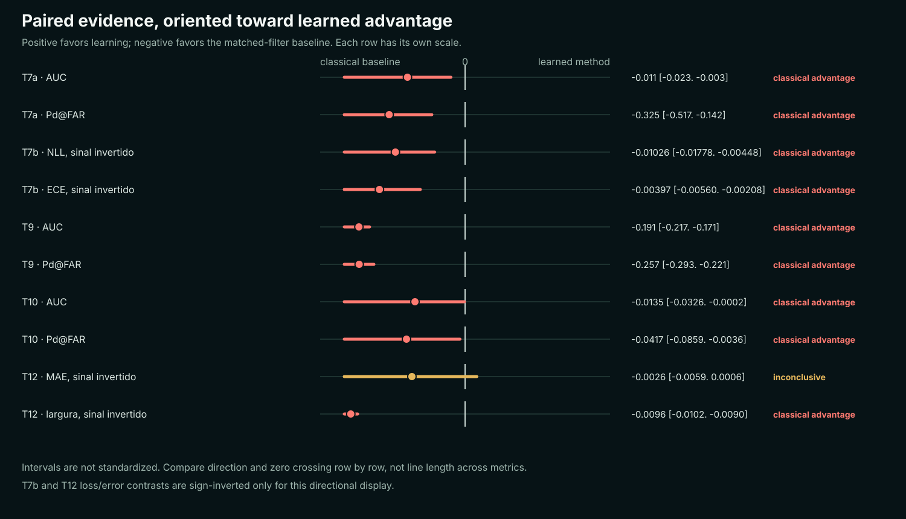

# HyperMix: um benchmark aberto para avaliação honesta da detecção de biossinais hiperespectrais engenheirados

Versão interna 0.1, 05/08/2026. Este rascunho ainda não está pronto para
submissão. O texto será traduzido para inglês somente depois da auditoria
externa e da decisão sobre o bloqueio T8.

## Resumo

Repórteres hiperespectrais geneticamente codificados permitem observar
expressão gênica bacteriana a distância, mas a detecção algorítmica de sinais
fracos em fundos naturais ainda exige comparações cuidadosas. Apresentamos o
HyperMix, um toolkit e benchmark aberto que avalia detecção, transferência
espectral, calibração, limite operacional e estimação de abundância sob
contratos explícitos de informação. O protocolo combina fundos hiperespectrais
reais com alvos implantados, espectros medidos, transformações físicas
declaradas e separação entre treino, calibração e avaliação. Métodos aprendidos
são comparados a matched filters espaciais, RX e detectores de subespaço com a
mesma informação disponível. Nos experimentos concluídos, nenhum método
aprendido superou de forma robusta o matched filter espacial bem calibrado. O
autoencoder de fundo e o ensemble calibrado foram significativamente piores em
seus critérios principais; a diferença agregada de MAE do unmixer foi
inconclusiva, mas seus intervalos foram mais largos. Uma tentativa
pré-especificada de avaliação no cubo biológico bioHSI não cruzou a porta de
reprodução da Figura 4g por falta de uma ponte validada de coordenadas. A
contribuição é um benchmark auditável de resultados negativos e inconclusivos,
com comandos, artefatos, checksums e limitações ligados em uma matriz pública.

## 1. Introdução

Chemla et al. introduziram repórteres hiperespectrais que codificam enzimas
produtoras de moléculas com assinaturas de absorção distinguíveis por câmeras
hiperespectrais. O estudo demonstrou detecção externa sob luz ambiente a até 90
m em uma imagem de 4.000 m² e selecionou biliverdina IXα e bacterioclorofila a
como repórteres candidatos. Esse resultado estabelece a viabilidade física do
sinal, mas não implica que um detector aprendido seja superior a um baseline
clássico bem ajustado.

Em detecção de alvo conhecido, o matched filter usa a assinatura espectral e a
covariância do fundo. Quando o alvo implantado tem estrutura espacial em blob,
uma versão suavizada também incorpora um prior espacial forte. Comparar uma
rede com esse baseline somente por pixel pode atribuir ao aprendizado uma
vantagem produzida pela suavização ou por vazamento de informação.

O HyperMix foi construído para tornar essas escolhas explícitas. Em vez de
buscar um regime favorável a uma arquitetura, o benchmark pergunta quais
premissas precisam ser removidas para que o aprendizado tenha uma vantagem
causal legítima. Isso inclui fundo não Gaussiano, incerteza calibrada,
assinatura desconhecida, transferência laboratório-sensor e estimação com
intervalos.

## 2. Princípios de desenho

### 2.1 Contratos de informação

Cada comparação declara o que o método conhece:

- `oracle`: recebe a assinatura exata usada na implantação;
- `family`: recebe apenas assinaturas relacionadas que excluem o alvo retido;
- `unknown`: não recebe alvo nem família, somente estatística da cena.

Um método aprendido só pode ser comparado ao baseline clássico sob o mesmo
contrato. O oracle é teto e não participa de um teste de superioridade quando
essa informação não estaria disponível na aplicação.

### 2.2 Separação de treino, calibração e avaliação

Seeds e implantes de treino, calibração e avaliação são distintos. Thresholds,
calibradores de probabilidade e intervalos conformais são ajustados antes da
avaliação final. Pixels vizinhos não são tratados como milhares de réplicas
independentes: os bootstraps usam casos definidos por cena, SNR, alvo retido ou
sensor, conforme o experimento.

### 2.3 Dados e alcance

Indian Pines, Salinas e Pavia University fornecem fundos hiperespectrais reais.
Os alvos nesses cubos são implantados digitalmente, portanto esses experimentos
medem robustez ao fundo e ao protocolo, não detecção de expressão biológica
naturalmente observada. Espectros do USGS e absorbâncias de pellets do bioHSI
ancoram parte do simulador em medidas públicas. A conversão por Beer-Lambert
produz uma curva semelhante a reflectância e continua sendo uma hipótese.

## 3. Métodos comparados

Os baselines incluem matched filter espectral e espacial, Adaptive Cosine
Estimator, RX e matched subspace detector. O primeiro detector aprendido é um
MLP que recombina MF, ACE e versões espacialmente suavizadas. Como essas
features são derivadas de detectores clássicos, o modelo não acessa informação
espectral descartada por eles. Um autoencoder espectral raso aprende a
reconstrução do fundo usando somente pixels não rotulados da própria cena. O
unmixer aprendido estima abundância fracionária.

As métricas de detecção são AUC e Pd em FAR fixo. Calibração probabilística usa
NLL, Brier e ECE. Quantificação usa MAE, viés, cobertura e largura média do
intervalo. Intervalos de 95% são calculados por bootstrap agrupado nos casos do
protocolo.

## 4. Resultados

<!-- BEGIN GENERATED MAIN RESULTS -->
| Eixo | Contraste principal | Resultado com IC 95% | Veredito |
|---|---|---|---|
| Fundo auto-supervisionado, T7a | autoencoder espacial menos MF espacial | AUC -0,011 [-0,023, -0,003]; Pd -0,325 [-0,517, -0,142] | aprendizado pior |
| Incerteza, T7b | ensemble menos MF espacial calibrado | NLL +0,01026 [0,00448, 0,01778]; ECE +0,00397 [0,00208, 0,00560] | aprendizado pior |
| Bandas, T7c | top-3 menos todas as bandas | AUC espacial -0,0356 [-0,0917, -0,0005]; menor k descritivo 20 | três bandas não bastaram |
| Alvo real, T8 | reprodução da Figura 4g nas caixas candidatas | MAE 0,156114; Pearson 0,375901 | porta bloqueada |
| Transferência, T9 | família física menos alvo laboratorial | AUC -0,191 [-0,217, -0,171]; Pd -0,257 [-0,293, -0,221] | aprendizado pior |
| Alvo retido, T10 | MLP familiar menos MF familiar | AUC -0,0135 [-0,0326, -0,0002]; Pd -0,0417 [-0,0859, -0,0036] | aprendizado pior |
| Limite, T11 | LOD em FAR 1e-2 e referência em FAR 1e-3 | nominal 15% a 20% em FAR 1e-2; >20% em FAR 1e-3 | resultado do simulador |
| Abundância, T12 | unmixer menos MF | MAE +0,0026 [-0,0006, 0,0059]; largura +0,0096 [0,0090, 0,0102] | MAE inconclusiva; intervalo pior |
<!-- END GENERATED MAIN RESULTS -->



**Figura 1.** Contrastes pareados com orientação comum: valores positivos
favorecem o método aprendido e valores negativos favorecem o baseline clássico.
Cada linha tem escala própria. O comprimento dos intervalos não deve ser
comparado entre métricas diferentes.

### 4.1 O baseline espacial permanece forte

No experimento de fundo, o autoencoder espacial foi inferior ao MF espacial em
AUC e Pd@FAR. No regime familiar, o MLP também perdeu para o MF construído com o
outro host medido. Quando nenhuma assinatura foi fornecida, MLP cego e RX
ficaram próximos do acaso. Nenhum desses resultados sustenta vantagem causal do
aprendizado.

### 4.2 Calibração não revelou uma vitória oculta

O MF espacial recebeu Platt scaling e o ensemble recebeu temperature scaling
com correção de intercepto, em implantes de calibração separados. O ensemble
teve NLL e ECE significativamente maiores. Na abundância, ambos os métodos
atingiram cobertura média acima de 90%, mas o intervalo do unmixer foi mais
largo. Cobertura isolada não mede eficiência do intervalo.

### 4.3 Transferência estreita foi útil, mas secundária

O critério pré-especificado de uma família física ampla falhou. Uma
transformação nominal determinada por metadados melhorou o alvo laboratorial em
análise secundária, com AUC +0,022 [0,016, 0,028] e Pd +0,134 [0,097, 0,169].
Esse resultado motiva validação independente da transformação estreita; ele não
autoriza substituir retroativamente o critério principal.

### 4.4 Esparsidade e limite operacional

As três bandas com maior peso absoluto no vetor do matched filter não
preservaram o desempenho completo. Vinte bandas foram o menor valor cuja AUC
espacial média ficou a até 0,005 da média com todas as bandas, uma descrição e
não uma prova de equivalência. No estudo de LOD, FAR 1e-2 produziu limites
nominais de 15% a 20%, enquanto nenhum sensor atingiu Pd 0,80 em FAR 1e-3 até a
grade de 20%. Esses percentuais são frações do simulador, não concentrações.

## 5. Porta de reprodução no alvo biológico real

O arquivo público bioHSI de 54 m contém o cubo, e a Source Data fornece nove
concentrações e nove scores regionais da Figura 4g. O notebook oficial, porém,
carrega `manually_defined_rectangle_coordinates.json`, ausente no arquivo de
dados e no release de código.

Uma hipótese geométrica baseada em caixas do arquivo de parâmetros foi
congelada antes da execução. A implementação HyperMix do método publicado
obteve MAE 0,156114 e Pearson 0,375901 contra os nove scores, falhando a porta
de MAE menor ou igual a 0,01 e Pearson maior ou igual a 0,99. A execução direta
da tag oficial nas mesmas caixas também falhou. Assim, o mapa produz scores na
escala publicada, mas a ponte entre caixas candidatas e regiões da figura não
está validada.

Nenhum detector foi comparado nessas regiões. Reposicionar caixas usando score
constituiria vazamento do resultado para a definição da unidade de avaliação.
T8 só será reaberto com o JSON manual, coordenadas completas fornecidas pelos
autores ou uma transformação geométrica independente.

## 6. Discussão

Os resultados mostram por que um baseline bem calibrado pode ser difícil de
superar quando o alvo é conhecido e o sinal espacial tem estrutura simples. O
MLP atual herda uma limitação adicional: suas features são funções do próprio
MF e do ACE. Uma arquitetura maior sobre as mesmas entradas não constitui uma
nova hipótese causal.

Resultados negativos não demonstram que nenhum método aprendido possa vencer
em qualquer cenário. Eles fecham as instanciações pré-especificadas no escopo
avaliado. Novos modelos precisam declarar qual informação adicional exploram,
como cubo bruto, variabilidade de fundo ou dinâmica espacial, e ser comparados
ao melhor clássico com o mesmo contrato.

A principal limitação é externa: ainda não há uma avaliação reproduzida sobre
expressão biológica medida. Também há somente três fundos principais, dois
hosts medidos para a família de biliverdina e modelos de sensor simplificados.
Os intervalos descrevem este benchmark e não uma população universal de
sensores ou ecossistemas.

## 7. Reprodutibilidade

Código, testes e resultados estão públicos sob licença MIT. A versão 0.5.0 está
arquivada no Zenodo sob DOI `10.5281/zenodo.21799951`. O manifesto em
`publication/evidence_manifest.json` liga oito afirmações a 16 artefatos,
comandos e checksums. A cadeia pode ser verificada sem dependências científicas:

```bash
python scripts/verify_evidence_manifest.py
```

Uma reprodução científica completa exige os ambientes e dados descritos em
`publication/EXTERNAL_REPRODUCTION.md`. O manuscrito final deve registrar uma
reprodução por pessoa externa e uma declaração transparente de assistência de
IA.

## 8. Conclusão

O HyperMix não demonstra um detector aprendido superior. Ele demonstra um
processo aberto para descobrir quando essa superioridade não aparece, inclusive
sob calibração, incerteza, alvo retido e decisão operacional. A contribuição é
uma cadeia auditável que preserva resultados negativos, resultados
inconclusivos e bloqueios de validade com o mesmo rigor usado para resultados
favoráveis.

## Referências iniciais verificadas

1. Chemla, Y., Levin, I., Fan, Y. et al. *Hyperspectral reporters for
   long-distance and wide-area detection of gene expression in living
   bacteria*. Nature Biotechnology 44, 258-268 (2026).
   https://doi.org/10.1038/s41587-025-02622-y
2. Blanchard, J., Casino, L. & Gierschendorf, J. *NeurIPS 2024 Ariel Data
   Challenge: Characterisation of Exoplanetary Atmospheres Using a Data-Centric
   Approach*. arXiv:2505.08940 (2025).
   https://doi.org/10.48550/arXiv.2505.08940
3. *One Channel Is All You Need*. DOI
   https://doi.org/10.1007/978-3-032-03705-3_4. A referência bibliográfica
   completa deve ser validada antes da submissão.

## Pendências editoriais

- completar revisão de literatura sobre matched filter, RX e conformal;
- gerar a tabela principal diretamente dos JSONs;
- selecionar figuras finais sem duplicar o observatório;
- obter reprodução externa;
- resolver ou documentar definitivamente T8;
- traduzir e revisar em inglês depois dos gates externos.
